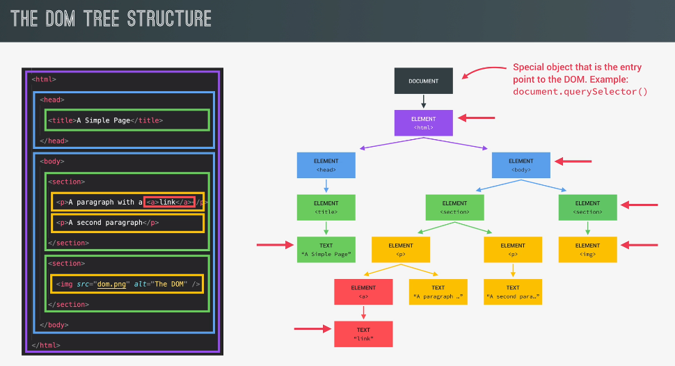

# What is a DOM ?

Document Object Model: Structued representation of HTML Documents allows Js to acess html elements and styles to manipulate them.

_Structured Representation_: The DOM represents the document as a tree of objects. Each object corresponds to a part of the document, such as elements, attributes, and text content. This tree-like structure allows you to access and modify specific parts of the document easily.

_Programming Interface_: The DOM provides a set of methods and properties that can be used by programming languages like JavaScript to interact with web pages. You can use these methods to create, delete, or modify HTML elements, change styles, update content, and respond to user actions.

_Dynamic Interactivity_: One of the main purposes of the DOM is to enable dynamic interactivity on web pages. It allows you to respond to user input (like clicks and keypresses), update the content of a page without requiring a full page reload, and create interactive web applications.

_Cross-Browser Compatibility_: The DOM is standardized by the World Wide Web Consortium (W3C), which means it's designed to work consistently across different web browsers. This standardization helps ensure that web applications behave consistently regardless of the browser being used.

# DOM !== JAVASCRIPT

DOM Methods and properties for DOM Manipulation, example document.querySelector() <-X->(Not a part of) JS

DOM methods and Properties are the part of Web APIs
& JS can interact with the web APIs

Web APIs (Application Programming Interfaces) are sets of rules and protocols that allow different software applications to communicate with each other over the internet. They define the methods and data formats that applications can use to request and exchange information.

In short, web APIs are like bridges that enable different software systems, services, or platforms to work together and share data or functionality, making it easier to build complex and interconnected applications on the web. They are commonly used for tasks like fetching data from a server, sending data to a server, accessing third-party services, and more.
