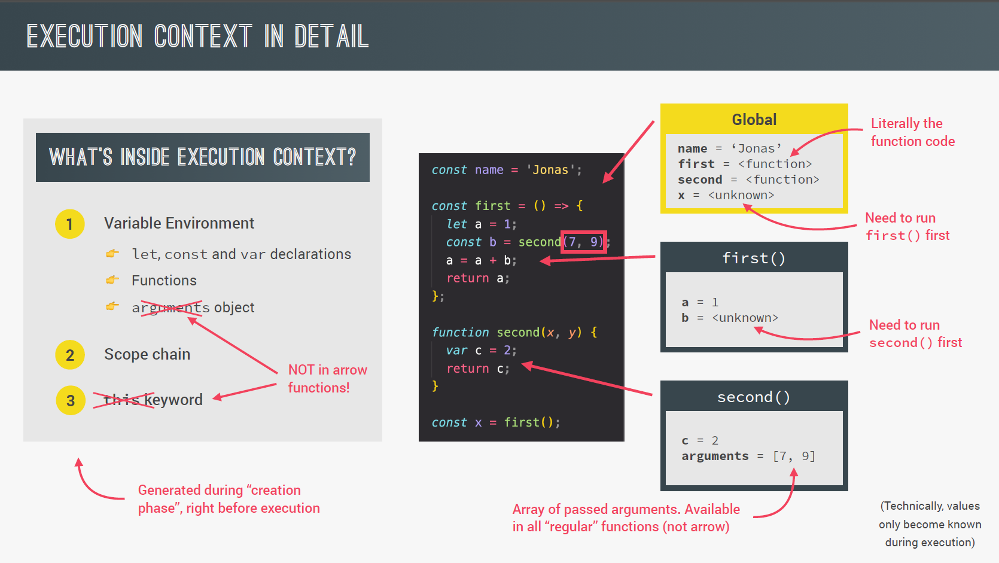

# How Javascript works behind the scene

In this section we are going to dive deep into how js works under the hood and get a better understanding of how things do what they do.

## Table of Contents

- An High-Level Overview of Javascript.
- The Javascript Engine and Runtime.
- Execution Contexts and The Call Stack

## An High-Level Overview of Javascript

### What is Javascript: Revisited

Remember we once defined js as "A high-level, object-oriented, multi-paradigm programming language."
Well it is coorect but this is just the tip of the iceberg.

So here is the new defination for you,

> **Javascript is a High-Level, Prototype-Based Object-Oriented, Multi-Paradigm, Interpreted or Just-In-Time Compiled, Dynamic, Single-Threaded, Garbage-Collected Programming Language with First-Class Functions and a Non-Blocking Event Loop Concurrency Model.😆😆**

Let's Deconstruct these Monster Defination :-

| Keyword | Meaning |
|---------|---------|
| High-level | Any computer program that run on computer needs hardware resources like memory and CPUs to do there work. Now there are Low-level Languages like C where you have to manually manage these resources for example asking the computer to create a new variable, on the other side there are High-level languages like python and Javascript where we do not have to manage resources at all because these languages have so called abstaraction that take all that work away from us (everything happens automatically) this make the languages easy to learn and use but the down side is these languages will never be as fast or as optimized as for example C programs |
| Garbage-collector | It is one of the tool that take memory management away from us which is basically an algorithm inside js engine which automatically remove all unused objects from computer memory in order to not clog it up with all the unnecessary stuff. Basically like a cleaning guy. |
| Interpreted or just-in-time compiled | A computer processor only understands 0s and 1s called machine code. We write humanreadable code which is an abstraction over machine code, the code that we write need to be converted to machine code which is either done by compiling or interpreting. In JS this happens inside the JS engine (More on this later in this section)|
| Multi-paradigm | JS is Multi-paradigm language. In programming, Paradigm is an approch and mindset of structuring code, which will direct your coding style and technique (it will get more clear as we more forward). There are three most popular paradigms they are  |
| | 1. Procedural programming : The one we've been using so far which is writing code in a very linear way and writing some function in between|
| | 2. Object Oriented Programming (OOP): (We will learn later in this course) |
| | 3. Functional programming (FP): (We will learn later in this course) |
| | We can also classify paradigms as *Imperative* or *Declarative*, more on that later. Many languages are only procedural, object oriented or functional but js is all three making it flexible and versatile. |
| Prototype-based object-oriented | Almost everything in javascript is an object except for primitive values, have you wondered why we can create an array and then use the for example push method on it that is because of prototypal inheritance. Basically we create arrays from an array blueprint which is like a template and this called the prototype, this prototype contain all the array methods and the arrays that we create in our code then inherit the methods from the blueprint so that we can use them on the arrays. This is the most oversimplified explaination (more on this in oops section)|
| First-class functions | Function are treated just as regular variables so we can pass functions into other functions and even return functions from functionsand this allows us to use a lot of powerfull techniques and also allows for functional-programming, not all languages have first-class functions but js does. |
| Dynamic | It is Dynamically typed, as we know we don't assign data type to variables infact they only became known when the js engine executes our code also the type of variable can easily be changed as we reassign variables and this is basically what dynamically-typed means and if we want to avoid this we can always look into TypeScript  |
| Single-threaded | Complex topic deal with it later |
| Non-blocking event loop | Complex topic deal with it later |

- **Concurrency model**: how the JavaScript engine handles multiple tasks happening at the same time.

       ⬇ Why do we need that?
- JavaScript runs in one **single thread** so it can only do one thing at a time

       ⬇ So what about a long-running task?
- Sounds like it would block the single thread. However, we want non-blocking behavior!

       ⬇ How do we achieve that?
- By using an **event loop** takes long running tasks, executes them in the "background", and puts them back in the main thread once they are finished.

       ⬆ (Oversimplified!)

<br>

## The Javascript Engine and Runtime

### What is a javascript engine?

*Js engine is simply a program that **Executes** Javascript code* example Google's V-Eight engine ➡️ powers Google crome and Node.js which is a JS runtime enviroment.

### Inside the JS Engine

A Js engine contains two things :-
- Call Stack : A call stack is where our code is actually executed using something called execution contexts
- Heap : The heap is an unstructured memory pool which stores all the objects that our application needs

### Computer science sidenote: Compilation Vs Interpretation

1. Compilation: Entire code is converted into machine code at once, and written to a binary file that can be executed by a computer.

```
 ----------------                 ----------------                 ------------------- 
|                |    Step 1     | Portable file: |     Step2     |                   |
|  Source code   | ------------> | machine code   |  ---------->  |  Program running  |
|                | Compilation   |                |   Execution   |                   |
 ----------------                 ----------------                 -------------------

```
Execution can happen way after compilation.

2. Interpretation: Interpreter runs through the source code and executes it line by line 

```
 ----------------                      -----------------
|                |    Step 1          |                 |     
|  Source code   | ------------------>| Program running | 
|                | Executed line      |                 |
 ----------------    by line           -----------------
```
Code still needs to be converted to machine code but that happens right before it's executed and not ahead of time.

*JavaScript **Used** to be a purely interpreted language*, but the problem with interpreted language is they are much much slower than compiled languages. This used to be ok for Javascript but now with modern javascript and fully fledged web apps that we built and use today example Google Maps, low performance is no longer acceptable.

Many people still thinks that JS is an interpreted language but that's **not really true anymore**. 

Modern Javascript engine **now** use a mix between compilation and interpretation which is called **just-in-time compilation**

3. Just-in-time (JIT) compilation: Entire code is converted into machine code at once, then executed immediately.

```
 ----------------                 --------------                 ------------------- 
|                |    Step 1     |              |     Step2     |                   |
|  Source code   | ------------> | Machine code |  ---------->  |  Program running  |
|                | Compilation   |              |   Execution   |                   |
 ----------------                 --------------                 -------------------

```
There is no portable file to execute and execution happens immediately after compilation, this makes JS faster than just executing codes line by line.

## So How does it works?

**Modern JIT Compilation of JavaScript**

**Code** : The code that is written in JavaScript

       ⬇️ Step 1

**Parsing** : To parse the code which essentially means to read the code. During the parsing process, the code is parsed into a data stucture called the **Abstact syntax tree or AST**. This works by first splitting up each line of code into pieces that are meaningful to the language like the const or function keywords and then saving all these peieces into the tree in a structured way. This step also checks if there are any syntax errors and the resulting tree will be later be used to generate the machine code


We don't need to know what an AST Look like it's just to show how the tree is created. 

*Remember* - This AST tree is nothing to do with the Dom tree, it is just the representation of code inside the js engine.

       ⬇️ Step 2

**Compilation** : Which takes the generated AST and comiples it into machine code.

       ⬇️ Step 3

**Execution** : This machine code then gets executed right away due to JIT compilation. And this execution happens inside JS engines call stack.

Now you might think that it's over but no actually Because modern JavaScript engines actually have some pretty clever optimization strategies, what they do is to create a very unoptimized version of machine code in the beginning just so that it can start executing as fast as possible. Then in the background, this code is being optimized and recompiled during the already running program execution and this can be done multiple times and after each optimization the unoptimized code is simply swept for the new more optimized code without ever stopping execution of course. This process is what makes modern engines such as V-Eight so fast.

Compilation➡️Execution➡️Optimization➡️Compilation

All this parsing, compilation and optimization happens in some special threads inside the engine that we cannot access from our code, completely separate from the main thread that is basically running into call stack executing our own code.

Now diffrent engines implements in slightly different ways but in a nutshell this is what modern JIT comilation looks like for JS.

## The Bigger Picture: JavaScript Runtime

### JavaScript Runtime in Browser


We can imagine a **JS runtime as a big box** which includes all the things that we need in order to use JS in this case, in the browser. And the **heart of any javascript runtime is always a javascript engine**, without this there is no runtime and no javascript at all however the engine alone is not enough. In order to work properly we also need access to the web API's. So essentially **web API's are functionalities provided to the engine but which are actually not part of the JavaScript language itself**. JS simply gets access to these API's through the **global window object**. But it still make sense that the web API's are also part of the runtime. Next a typical JS runtime also include a so called **callback queue**. This is a **data structure that contains all the callback functions that are ready to be executed**. For example we attach event handler functions to DOM elements like a button to react to certain events, and these event handler functions are also called callback functions. So as the event happens for example a click, the callback function will be called. The first thing that actually happens after the event is that the callback is put into the callback queue then when the stack is empty the callback function is passed to the stack so that it can be executed. And this happens by something called the event loop so basically **the event loop takes callback functions from the callback queue** and puts them in the call stack so that they can be executed. The **event loop is how javascript non-blocking concurrency model** is implemented and this was the overview of how that works(we will learn more of Non-blocking and event loops later). 

### JavaScript Runtime outside the Browser


It is pretty similar, but since we don't have a browser of course, we cant have the web API's because it's the browser who provides these. Instead we have multiple C++ bindings and a so called thread pool.

<br>

## Execution Contexts and The Call Stack

### What is an Execution context in JavaScript?


An execution context in JavaScript is a concept that helps manage the execution of code. It's a fundamental concept in understanding how JavaScript code runs. An execution context can be thought of as an environment or a container that holds all the necessary information for the JavaScript engine to execute a piece of code.

There are three main types of execution contexts in JavaScript:

1. **Global Execution Context**: This is the outermost and default execution context. It represents the global scope of the program. When a JavaScript program starts running, the global execution context is created, and it includes variables and functions declared in the global scope. Every JavaScript program has one global execution context.

2. **Function Execution Context**: A new function execution context is created every time a function is invoked (called). It includes variables and parameters specific to that function. Each function has its own execution context, and they can be nested if one function calls another.

3. **Eval Function Execution Context** (not used as frequently): In JavaScript, there is a function called `eval` that can execute code from a string. When `eval` is used, it creates a new execution context to run the code inside the string.

Each execution context has its own "variable environment," which includes variables, function declarations, and function parameters specific to that context. Additionally, execution contexts are organized into a call stack, known as the **"call stack,"** where the topmost execution context represents the currently executing code.

When JavaScript code is executed, the engine pushes new execution contexts onto the call stack as functions are called, and it pops them off the stack when functions complete their execution.

Execution contexts also play a role in scope and variable access, as they determine where variables and functions can be accessed within your code. Understanding execution contexts is crucial for understanding the order of execution and variable scoping in JavaScript.

### Execution context in detail.



An execution context in JavaScript is a fundamental concept that manages the execution of code. It's like a container that holds all the necessary information for the JavaScript engine to run a specific piece of code. Each time a function is called, a new execution context is created, and these contexts are organized in a call stack.

Here's a detailed breakdown of what's inside an execution context in JavaScript:

1. **Variable Environment**: This is where variables, function declarations, and function parameters are stored. It includes:
   - **Local Variables**: Variables declared within the function.
   - **Function Parameters**: Parameters passed into the function.
   - **Function Declarations**: Functions declared with `function`.

2. **Scope Chain**: The scope chain is an important part of an execution context. It defines the order in which JavaScript looks up variables. It includes:
   - **Local Scope**: The innermost scope where the function's variables are defined.
   - **Outer Scopes**: If a variable is not found in the local scope, JavaScript looks up the scope chain to find it in the outer scopes, such as the function's parent scope or the global scope.

3. **This Binding**: The `this` keyword refers to the current object in a function. The value of `this` is determined by how a function is called (e.g., as a method, as a constructor, or with `apply()` or `call()`).

4. **Outer Environment**: This refers to the lexical environment in which the current function was declared. It helps in accessing variables from outer functions or the global scope.

5. **Function Reference**: In the case of named function expressions, this property contains a reference to the function itself. It helps with recursion and self-invocation.

6. **Code Execution**: This is where the actual code of the function is executed. JavaScript follows a single-threaded, synchronous execution model, meaning it executes one statement at a time.

7. **Closure**: A closure is a special type of execution context that retains access to its outer function's scope, even after the outer function has finished executing. Closures are often used to create private variables and data encapsulation.

8. **Creation Phase**: Before executing the code in an execution context, JavaScript goes through a "creation phase" to set up the environment. During this phase, it hoists variable declarations and function declarations, so they are accessible throughout the entire scope.

9. **Execution Phase**: After the creation phase, JavaScript begins executing the code in the function. It processes statements one by one, and it can access variables and functions defined within the context.

10. **Memory Heap**: While not part of the execution context itself, the memory heap is where JavaScript allocates memory for objects and data structures used in the program. This is where objects, arrays, and other data are stored.

Understanding execution contexts is essential for understanding scope, variable access, and the order of execution in JavaScript. It's a core concept that helps developers write efficient and reliable code.

Let's look at an example to demonstrate execution contexts in JavaScript:

```javascript
// Global scope
const globalVar = "I'm in the global scope";

function outerFunction() {
  // Outer function scope
  const outerVar = "I'm in the outer function scope";

  function innerFunction() {
    // Inner function scope
    const innerVar = "I'm in the inner function scope";
    console.log(globalVar);  // Access global variable
    console.log(outerVar);  // Access outer function variable
    console.log(innerVar);  // Access inner function variable
  }

  return innerFunction;
}

const innerFunc = outerFunction();  // Calls outerFunction, returns innerFunction
innerFunc();  // Calls innerFunction

console.log(globalVar);  // Access global variable outside functions
// console.log(outerVar);  // This would result in an error because outerVar is not accessible here
// console.log(innerVar);  // This would also result in an error for the same reason
```

In this example:

1. We have a global scope that contains a global variable `globalVar`.

2. We define an `outerFunction` that has its own scope. It declares a variable `outerVar` within its scope.

3. Inside `outerFunction`, there's an `innerFunction` with its own scope, and it declares a variable `innerVar`.

4. When `innerFunc` is called, it executes `innerFunction`. Inside `innerFunction`, we can access variables from the global, outer function, and inner function scopes.

5. We demonstrate that variables in the global scope are accessible globally, but variables declared in function scopes are not accessible outside those functions.

This example illustrates how execution contexts and scope work in JavaScript. Each function call creates a new execution context with its own variable environment, and variables are looked up in a hierarchical manner through the scope chain.

### Arrow function and Execution context.

Arrow functions in JavaScript have a special relationship with execution contexts and the `this` keyword. Understanding this relationship is important when working with arrow functions.

In traditional function declarations or expressions, the value of the `this` keyword is dynamically determined based on how the function is called. This can lead to unexpected behavior in certain situations, especially when functions are used as callbacks or event handlers.

Arrow functions, on the other hand, do not have their own `this` binding. Instead, they inherit the `this` value from their containing (enclosing) lexical context. This behavior makes arrow functions particularly useful when you want to maintain a consistent `this` value, especially in callback functions within classes or object methods.

Here's a brief summary of the relationship between arrow functions and execution contexts:

1. **No Dynamic `this`**: Arrow functions do not have their own `this`. They rely on the `this` value from the surrounding lexical context (i.e., the context in which they are defined).

2. **Enclosing Context**: The value of `this` in an arrow function is determined by the closest non-arrow parent function or scope. This is often the function or object that encloses the arrow function.

3. **Consistent `this`**: Arrow functions are handy when you want to maintain a consistent `this` value within a function, especially when dealing with classes, object methods, or callbacks where `this` may change in traditional functions.

Here's an example to illustrate the difference:

```javascript
function regularFunction() {
  console.log(this); // 'this' refers to the global object (e.g., 'window' in a browser)
}

const arrowFunction = () => {
  console.log(this); // 'this' still refers to the global object because it inherits from the enclosing context
}

const obj = {
  method: () => {
    console.log(this); // 'this' refers to the global object because it inherits from the enclosing context (not the 'obj' object)
  }
};

regularFunction(); // 'this' is the global object
arrowFunction();   // 'this' is the global object
obj.method();      // 'this' is the global object
```

In the example above, the arrow function `arrowFunction` and the arrow function within the `obj` object's method both inherit the global `this` because there is no dynamic binding of `this` within arrow functions.

In summary, arrow functions have a simpler relationship with execution contexts and `this`, making them suitable for scenarios where you want to avoid the complexity of traditional function binding. However, it's essential to be aware of their behavior when using them in different contexts.

Arrow functions in JavaScript do not have their own `arguments` object like traditional function declarations or expressions. This is one of the key differences between arrow functions and regular functions.

The absence of an `arguments` object in arrow functions is intentional and aligns with the design philosophy of arrow functions, which aim to simplify and provide more predictable behavior. Here's why there's no `arguments` object in arrow functions:

1. **Lexical Scoping**: Arrow functions use lexical scoping for variables, including their parameters. This means that they inherit the values of variables (including parameters) from their containing (enclosing) lexical context. In contrast, regular functions have their own `arguments` object that contains all the arguments passed to the function.

2. **Predictable Behavior**: Arrow functions are designed to have more predictable behavior. In regular functions, the `arguments` object can be confusing because it includes not only named parameters but also any additional arguments passed to the function. This behavior can lead to unexpected results, especially when using functions as callbacks.

3. **Rest Parameters**: Instead of relying on the `arguments` object, arrow functions encourage the use of rest parameters (`...`) to capture all arguments in a more explicit and readable way. You can use rest parameters to collect all arguments into an array-like structure.

Here's an example that illustrates the difference between a regular function and an arrow function regarding the `arguments` object:

```javascript
function regularFunction() {
  console.log(arguments); // This works, and 'arguments' refers to the arguments passed to the function.
}

const arrowFunction = () => {
  console.log(arguments); // Error: 'arguments' is not defined in the scope of an arrow function.
}

regularFunction(1, 2, 3); // 'arguments' contains [1, 2, 3]
arrowFunction(1, 2, 3);   // Throws an error
```

If you need to work with function arguments within an arrow function, you should use rest parameters to explicitly capture them:

```javascript
const arrowFunctionWithRest = (...args) => {
  console.log(args); // 'args' is an array containing all arguments passed to the function.
}

arrowFunctionWithRest(1, 2, 3); // 'args' contains [1, 2, 3]
```

In summary, the absence of an `arguments` object in arrow functions promotes more straightforward and less error-prone code by encouraging the use of rest parameters and relying on lexical scoping.

### The Call Stack


The call stack is a fundamental concept in the execution of code in programming languages, including JavaScript. It represents the order in which functions are called and executed within a program. Let's break down the call stack step by step:

1. **Function Calls**: Whenever a function is called in your code, a new entry, known as a "stack frame" or "call frame," is created in the call stack to store information about that function call. This information includes the function's name, its parameters, and the line of code where the function was called.

2. **Stack-Like Structure**: The call stack operates like a stack data structure, following the Last-In-First-Out (LIFO) principle. This means that the most recently called function is at the top of the stack, and it needs to finish executing before the program can return to the previous function.

3. **Push and Pop**: When a function is called, a new stack frame is "pushed" onto the top of the stack. When a function completes its execution (returns), its stack frame is "popped" off the stack, and the program returns to the previous function in the stack.

4. **Tracking Execution Flow**: The call stack keeps track of the execution flow of your program. It ensures that function calls are executed in the correct order and that each function finishes before moving to the next.

5. **Recursive Calls**: In the case of recursive functions (functions that call themselves), multiple instances of the same function can appear in the call stack, each with its own set of parameters and execution context.

6. **Stack Overflow**: If the call stack becomes too deep, it can lead to a "stack overflow" error. This occurs when there are too many nested function calls, and the stack runs out of memory to hold additional stack frames.

Here's a simplified example to illustrate the call stack:

```javascript
function greet(name) {
  console.log(`Hello, ${name}!`);
}

function sayHello() {
  greet("Alice");
  greet("Bob");
}

sayHello();
```

In this example:

1. `sayHello` is called, creating a stack frame for `sayHello`.
2. `sayHello` calls `greet("Alice")`, creating a stack frame for `greet`.
3. `greet("Alice")` completes and is popped off the stack.
4. `greet("Bob")` is called, creating another stack frame for `greet`.
5. `greet("Bob")` completes and is popped off the stack.
6. Finally, the `sayHello` stack frame completes and is popped off the stack. 

Understanding the call stack is crucial for debugging, as it helps you trace the order of function calls and identify any issues, such as infinite loops or stack overflow errors, in your code.